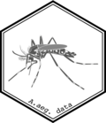

<!-- README.md is generated from README.Rmd. Please edit that file -->

```{r setup, include = FALSE}
knitr::opts_chunk$set(
  collapse = TRUE,
  comment = "#>",
  fig.path = "man/figures/README-",
  out.width = "100%"
)
```

# aaegdata 

[](https://zenodo.org/badge/latestdoi/138066714)
<!-- [](https://travis-ci.org/r-lib/pkgdown) -->
<!-- [](https://ci.appveyor.com/project/r-lib/pkgdown) -->
<!-- [](https://www.tidyverse.org/lifecycle/#maturing) -->
<!-- [](https://www.repostatus.org/#active) -->
<!-- [](https://cran.r-project.org/package=pkgdown) -->
<!-- [](https://codecov.io/github/r-lib/pkgdown?branch=master) -->

This is a data package containing *Aedes aegypti* vector mosquitoes biologically relevant molecular and biochemical data. Data colected from public available databases and presented here in a clean, structured and ready to use format. The consistent format used for the data allows the use of modern syntax and tools to be used with this package. 

## Installation

<!-- You can install the released version of aaegdata from [CRAN](https://CRAN.R-project.org) with:

``` r
install.packages("aaegdata")
```
-->

 You can install the development version from [GitHub](https://github.com/) with:

```r
# install.packages("devtools")
devtools::install_github("luciorq/aaegdata")
```

## Examples

Those are basic examples which shows you how to solve common problems:

### Check first 15 genes that changed annotation in AaegL5.1

```{r annotation_conversion}
library(dplyr)

aaegdata::annotation_conversion %>%
  dplyr::filter( !is.na(gene_aaegl35) & !is.na(gene_aaegl51)) %>%
  dplyr::filter( gene_aaegl35 != gene_aaegl51 ) %>%
  head(15)
```

### Retrieving gene ontologies for a gene

```{r go_gene}
## Using gene AAEL000986
aaegdata::go_gene_sets %>%
  dplyr::filter(gene == "AAEL000986") %>%
  dplyr::select( -gene)

```

### Checking gene description by part of name

```{r gene_description}
library(stringr)
aaegdata::gene_description %>%
  dplyr::filter( stringr::str_detect( gene_name, "Rpl") )
```

### Computed homology in the closest model organism (*D. melanogaster*)

```{r homology}
aaegdata::aaeg_dmel_orthologs %>%
  dplyr::filter( gene == "AAEL000986")
```

----
Please note that this project is released with a [Contributor Code of Conduct](CODE_OF_CONDUCT.md). By participating in this project you agree to abide by its terms.
