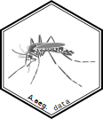

<!-- README.md is generated from README.Rmd. Please edit that file -->
aaegdata 
==================================================================

[](https://zenodo.org/badge/latestdoi/138066714)

This is a data package containing *Aedes aegypti* vector mosquitoes biological relevant molecular and biochemical data. Data colected from public available databases and presented here in a clean, structured and ready to use format. The consistent format used for the data allows the use of modern syntax and tools to be used with this package.

Installation
------------

<!-- You can install the released version of aaegdata from [CRAN](https://CRAN.R-project.org) with:

``` r
install.packages("aaegdata")
```
-->
You can install the development version from [GitHub](https://github.com/) with:

``` r
# install.packages("devtools")
devtools::install_github("luciorq/aaegdata")
```

Examples
--------

Those are basic examples which shows you how to solve common problems:

### Check first 15 genes that changed annotation in AaegL5.1

``` r
library(dplyr)
#> 
#> Attaching package: 'dplyr'
#> The following objects are masked from 'package:stats':
#> 
#>     filter, lag
#> The following objects are masked from 'package:base':
#> 
#>     intersect, setdiff, setequal, union

aaegdata::annotation_conversion %>%
  dplyr::filter( !is.na(gene_aaegl35) & !is.na(gene_aaegl51)) %>%
  dplyr::filter( gene_aaegl35 != gene_aaegl51 ) %>%
  head(15)
#> # A tibble: 15 x 2
#>    gene_aaegl35 gene_aaegl51
#>    <chr>        <chr>       
#>  1 AAEL000003   AAEL021256  
#>  2 AAEL000014   AAEL019508  
#>  3 AAEL000015   AAEL019624  
#>  4 AAEL000015   AAEL019625  
#>  5 AAEL000034   AAEL023601  
#>  6 AAEL000054   AAEL021963  
#>  7 AAEL000060   AAEL024813  
#>  8 AAEL000062   AAEL022948  
#>  9 AAEL000067   AAEL026496  
#> 10 AAEL000068   AAEL021083  
#> 11 AAEL000070   AAEL021708  
#> 12 AAEL000082   AAEL020708  
#> 13 AAEL000083   AAEL019508  
#> 14 AAEL000086   AAEL026937  
#> 15 AAEL000093   AAEL025818
```

### Retrieving gene ontologies for a gene

``` r
## Using gene AAEL000986
aaegdata::go_gene_sets %>%
  dplyr::filter(gene == "AAEL000986") %>%
  dplyr::select( -gene)
#> # A tibble: 6 x 2
#>   gene_ontology                                           go_domain       
#>   <chr>                                                   <chr>           
#> 1 GO:0003954_NADH dehydrogenase activity                  molecular_funct…
#> 2 GO:0005739_mitochondrion                                cellular_compon…
#> 3 GO:0005747_mitochondrial respiratory chain complex I    cellular_compon…
#> 4 GO:0006120_mitochondrial electron transport, NADH to u… biological_proc…
#> 5 GO:0008137_NADH dehydrogenase (ubiquinone) activity     molecular_funct…
#> 6 GO:0016021_integral component of membrane               cellular_compon…
```

### Checking gene description by part of name

``` r
library(stringr)
aaegdata::gene_description %>%
  dplyr::filter( stringr::str_detect( gene_name, "Rpl") )
#> # A tibble: 3 x 3
#>   gene      description                                          gene_name
#>   <chr>     <chr>                                                <chr>    
#> 1 AAEL0000… 60S ribosomal protein L36 [Source:UniProtKB/TrEMBL;… Rpl36-1  
#> 2 AAEL0008… 60S ribosomal protein L35A, putative [Source:UniPro… Rpl35    
#> 3 AAEL0026… 60S ribosomal protein L36 [Source:UniProtKB/TrEMBL;… Rpl36-2
```

### Computed homology in the closest model organism (*D. melanogaster*)

``` r
aaegdata::aaeg_dmel_orthologs %>%
  dplyr::filter( gene == "AAEL000986")
#> # A tibble: 1 x 7
#>   gene  dmel_gene dmel_gene_name dmel_homology_t… dmel_to_aaeg_id…
#>   <chr> <chr>     <chr>          <chr>                       <dbl>
#> 1 AAEL… FBgn0029… ND-ASHI        ortholog_one2one             56.3
#> # ... with 2 more variables: aaeg_to_dmel_identity <dbl>,
#> #   dmel_protein <chr>
```

------------------------------------------------------------------------

Please note that this project is released with a [Contributor Code of Conduct](CODE_OF_CONDUCT.md). By participating in this project you agree to abide by its terms.
